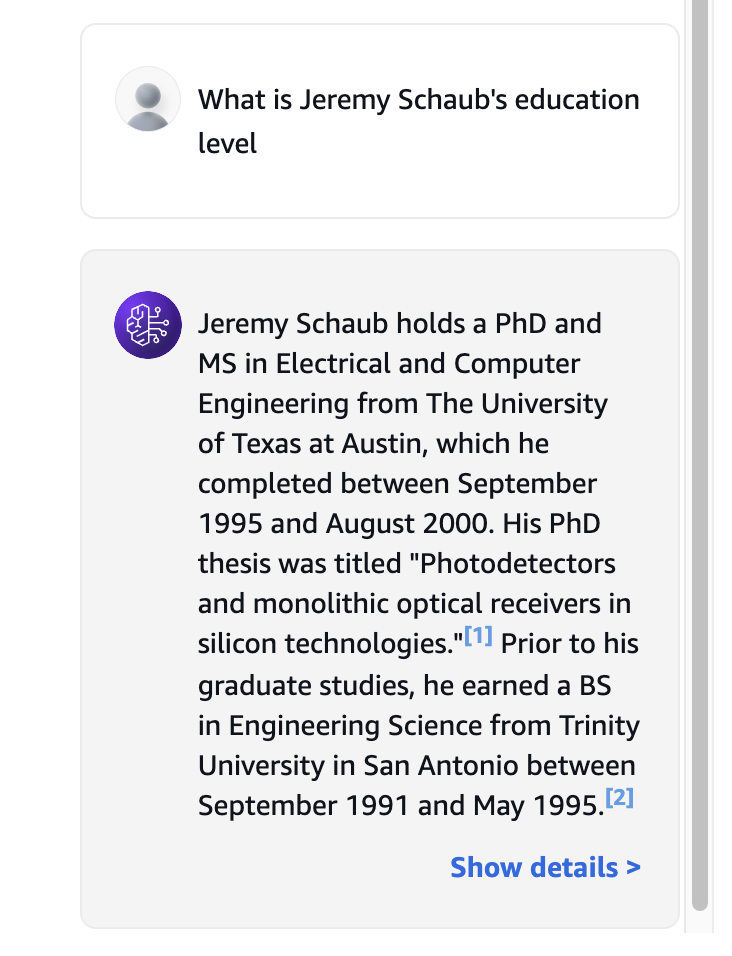
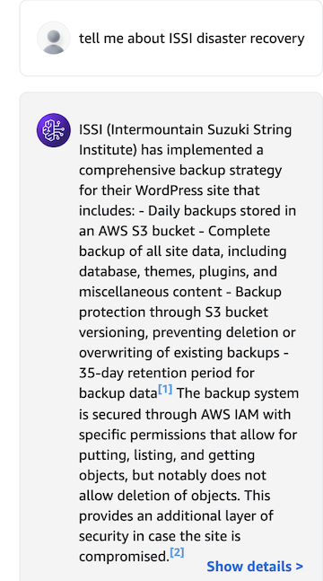

# AskJerm demo using Amazon Bedrock

Interview my AI agent!

AskJerm is a Generative AI implementation using [AWS Bedrock][Bedrock]. The AskJerm
agent invokes a [RAG (Response-Augmented Generation)][RAG] pipeline to combine queries
with knowledge bases that have been ingested and stored in a vector database. The
"augmented" query is then sent to the [Anthropic Claude v2][Claude] foundational model.

Knowledge Bases used:
- [The text of my resume](data/Schaub_CV_2024-11-full.txt) uploaded to an S3 bucket
- [The content of my website][website] using a web crawler
- some papers and publications that I have written (TODO)

## Components
1. [AWS Bedrock][Bedrock] Agent.
2. [AWS Lambda function][lambda] that invokes the agent.
3. [API Gateway endpoint][gateway] to invoke the lambda function
4. [Web client](webapp) to call the endpoint

## Setup
Here are the steps to setup the agent:
1. Create knowledge bases (created manually via the AWS Console)
2. Create agent (created manually via the AWS Console)
3. Create Lambda function to invoke agent (deployed via [SAM template][SAM])
4. Create API Gateway endpoint to invoke Lambda function (deployed via [SAM template][SAM])

## Creating the agent

### Request model access
1. Request access to foundational model (`anthropic.claude-3-5-sonnet-20241022-v2:0`)
2. *Important* request access to embeddings model (`amazon.titan-embed-text-v2:0`)

### Create the knowledge base
1. Create an S3 bucket and upload the input document(s)
2. From the [AWS Bedrock console][Console] -> Knowledge Bases, create a knowledge base
3. Add a data source from the S3 bucket with default settings
4. Add a data source using a web crawler pointing to [my website][website]
5. Sync the data sources (make sure you have requested access to both the foundational model and the embeddings model)

## Testing the Knowledge bases
After creating the knowledge base and syncing the data sources, I tested the model via
the knowledge base console.

For example, my education level is listed in the text of my resume:

To test the web crawler, I asked a question about a [disaster recovery blog post][DR]
from my site.

## Code
- [simple conversing with foundational model](src/simple_converse.py) (No knowledge bases)
- [simple script to invoke the agent](src/simple_agent.py)
- [lambda function to invoke the agent][lambda]

[Bedrock]: https://aws.amazon.com/bedrock/
[RAG]: https://aws.amazon.com/what-is/retrieval-augmented-generation/
[Claude]: https://www.anthropic.com/news/claude-2
[website]: https://jeremyschaub.us/
[lambda]: sam/src/invoke_agent/app.py
[gateway]: https://aws.amazon.com/api-gateway/
[SAM]: sam/README.md
[Console]: https://console.aws.amazon.com/bedrock/
[DR]: https://jeremyschaub.us/posts/post013-issi-dr/index.html
